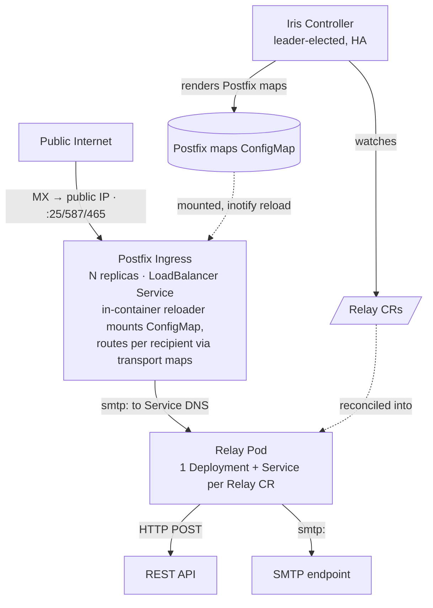

# Iris

> A single public SMTP entrypoint for your Kubernetes cluster, declaratively routed, filtered, transformed, and fanned out to your services.

[](LICENSE.md)

**Iris** is a Kubernetes controller that gives a cluster **one stable, public point of entry for
inbound email** and turns each message into something your in-cluster services can consume. You
describe what mail you want and where it should go with a `Relay` custom resource. Iris does the
rest by terminating public SMTP, filtering and scoring inbound messages, transforming them into a
canonical JSON envelope (with optional [Jsonnet](https://jsonnet.org/) remapping), and delivering
to one or more HTTP or SMTP destinations.

A replicated **Postfix ingress** terminates public SMTP and handles the hard MTA concerns (TLS,
queueing, retry/backoff, bounces). The **Iris controller** watches `Relay` resources, compiles them
into Postfix routing maps, and reconciles one stateless **relay pod** per `Relay` that does the
filtering, transforming, and fan-out.



See [docs/architecture.md](docs/architecture.md) for the full design.

## Why Iris?

Plenty of the outside world still talks to software over email. Apple mails App Store
invitations, payment processors send receipts, partners forward reports. Getting those messages
into a Kubernetes cluster is the awkward part. Ingress controllers speak HTTP, not raw SMTP on
port 25, so the usual answer is to stand up a Postfix box by hand and then write glue to get
messages back out of it. You parse the MIME, check DKIM, decide whether it is spam, and POST the
result somewhere. Every new consumer means another round of Postfix map edits and another one-off
script.

Iris turns that into something you declare. Postfix stays where it belongs and keeps doing what a
real MTA is good at, including TLS, queueing, retry with backoff, and bounces, but you never edit
its config by hand. You write a `Relay` that names the addresses you want and the destinations
they go to. The controller compiles the routing and reconciles one relay pod per `Relay` that
filters each message, normalizes it to a JSON envelope, and delivers it over HTTP or SMTP.

What you get is an entrypoint that behaves like the rest of your cluster. There is one stable
public IP for your MX records, routing changes by editing a resource instead of logging into a
mail server, and the data plane stays stateless because the hard delivery guarantees live in
Postfix. A failed delivery to a required destination comes back as an SMTP 4xx so Postfix retries
the message, and every delivery carries an idempotency key so downstream services can dedup.

Managed services solve the same problem well in their own setting. AWS SES inbound, for example,
receives mail and hands it to S3, SNS, or Lambda, which is a good fit when your workloads already
live in AWS and you want the provider to run the receiving side. Iris is the in-cluster
counterpart. The entrypoint lives in your own cluster, stays portable across clouds, and delivers
straight to the services you already run. Which one fits comes down to where your services already
are, not to one being better than the other.

## Example

A `Relay` claims a set of recipient addresses, optionally filters inbound mail, and fans each
accepted message out to all destinations:

```yaml
apiVersion: iris.philprime.dev/v1alpha1
kind: Relay
metadata:
  name: appstore-invites
  namespace: example
spec:
  # What mail this relay claims → compiled into Postfix routing
  routes:
    - address: invites@invite.example.com # exact address (wins over domain)
    - domain: invite.example.com # any local-part on the domain

  # Inbound filtering → relay rejects with SMTP 5xx before transforming (optional).
  # Hard gates reject first. A message must then also clear the heuristic score.
  filters:
    # Hard gates: all must pass
    maxMessageBytes: 26214400 # 25 MiB
    allowedSenderDomains: ["email.apple.com"]
    requireDKIM: ["email.apple.com"] # a valid DKIM d= must match one of these
    # Heuristic score: accept only when the summed signals reach minScore
    minScore: 2
    scoreSignals: [
      fromDomain,
      messageIdDomain,
      dkimDomain,
      bodyLinkDomain,
    ]

  # Delivery → fan-out to ALL destinations (broadcast)
  idempotency: messageId # messageId (default) | sha256
  destinations:
    - name: webhook
      required: true # failure → SMTP 4xx → Postfix retries the message
      http:
        url: https://service.internal/inbound
        payloadFormat: json # json (canonical envelope, default) | raw (rfc822)
        authSecretRef: { name: webhook, key: token }
        transform: # optional Jsonnet remap
          jsonnetConfigMapRef: { name: mapping, key: map.jsonnet }
    - name: archive
      required: false # best-effort; failure logged + metered, no retry
      smtp:
        host: archive.internal
        port: 1025
```

The generated CRD field reference is in [docs/crd-reference.md](docs/crd-reference.md). The field
semantics, conflict resolution, and status conditions are in [docs/kubernetes.md](docs/kubernetes.md).
The data-plane pipeline, filter signals, canonical JSON envelope, and delivery contract are in
[docs/relay.md](docs/relay.md).

## Installation

Iris is distributed as container images and an OCI Helm chart on GitHub Container Registry. A
default install needs cert-manager and a cluster that can provision `LoadBalancer` Services:

```sh
helm install iris oci://ghcr.io/philprime/charts/iris \
  --version X.Y.Z \
  -n iris-system --create-namespace
```

See [docs/install.md](docs/install.md) for prerequisites, pointing your MX records at the ingress,
configuration, and verifying the install.

## Documentation

The full documentation lives in [`docs/`](docs/). Good places to start:

- [architecture.md](docs/architecture.md) for how Iris is designed and how mail flows through it.
- [install.md](docs/install.md) to deploy the chart into a cluster.
- [development.md](docs/development.md) to set up a local environment.

## Contributing

Contributions are welcome. Iris is a Go project driven through its `Makefile`, so run `make help`
to discover targets. Set up a local environment with `make init` and follow
[development.md](docs/development.md). Coding standards and commit conventions are in
[conventions.md](docs/conventions.md).

## License

Licensed under the [Functional Source License, Version 1.1, MIT Future License](LICENSE.md)
(`FSL-1.1-MIT`).
