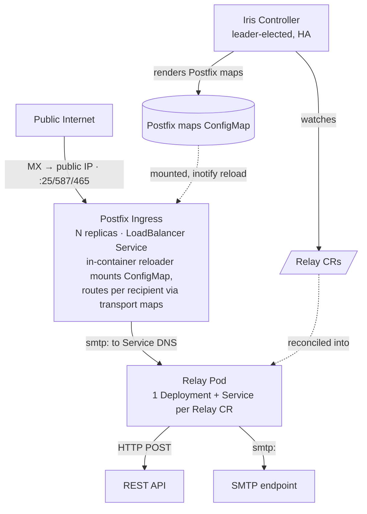

# Iris

> A single public SMTP entrypoint for your Kubernetes cluster, declaratively routed, filtered, transformed, and fanned out to your services.

[](LICENSE.md)

**Iris** is a Kubernetes controller that gives a cluster **one stable, public point of entry for
inbound email** and turns each message into something your in-cluster services can consume. You
describe what mail you want and where it should go with a `Relay` custom resource. Iris does the
rest by terminating public SMTP, filtering and scoring inbound messages, transforming them into a
canonical JSON envelope (with optional [Jsonnet](https://jsonnet.org/) remapping), and delivering
to one or more HTTP or SMTP destinations.

A replicated **Postfix ingress** terminates public SMTP and handles the hard MTA concerns (TLS,
queueing, retry/backoff, bounces). The **Iris controller** watches `Relay` resources, compiles them
into Postfix routing maps, and reconciles one stateless **relay pod** per `Relay` that does the
filtering, transforming, and fan-out.



> **Status:** early development. The API group is `iris.philprime.dev/v1alpha1`. Expect breaking
> changes while the API stabilizes.

## Why Iris?

Exposing a cluster to inbound email usually means hand-rolling a Postfix relay and wiring it to
each consumer by hand. Iris makes that declarative and operator-managed.

- **One stable entrypoint.** A single public IP (port 25, plus 587/465) for your cluster's MX
  records, regardless of how many services consume mail.
- **Declarative routing.** A `Relay` CR maps recipient addresses/domains to destinations. There
  are no manual Postfix edits, and the controller compiles the maps and reloads the ingress only
  when routes change.
- **Inbound filtering & scoring.** Reject oversized messages, unknown senders, or messages that
  fail DKIM, and accept/deny on a configurable heuristic score before anything is forwarded.
- **Transform once, fan out anywhere.** Every message becomes a canonical JSON envelope, and each
  destination optionally remaps it with Jsonnet and delivers over HTTP or SMTP.
- **Lean on Postfix for the hard parts.** TLS, the queue, retry/backoff, and bounces stay in
  Postfix. Everything Iris itself owns is stateless.
- **At-least-once delivery.** Failed deliveries to `required` destinations return SMTP 4xx so
  Postfix retries, and every delivery carries an idempotency key so downstreams can dedup.

## How it works

1. Mail arrives on the public LoadBalancer Service and is accepted by Postfix.
2. Postfix routes each recipient to the matching relay's in-cluster Service via generated
   transport maps.
3. The relay runs its pipeline (**filter → transform → fan out**) and reflects the result back
   to Postfix as an SMTP status code.
4. If a `required` destination fails, the relay returns SMTP 4xx and Postfix keeps the message in
   its queue and retries with backoff. The relay holds no state.

See [docs/architecture.md](docs/architecture.md) for the full design.

## Example

A `Relay` claims a set of recipient addresses, optionally filters inbound mail, and fans each
accepted message out to all destinations:

```yaml
apiVersion: iris.philprime.dev/v1alpha1
kind: Relay
metadata:
  name: appstore-invites
  namespace: example
spec:
  # What mail this relay claims → compiled into Postfix routing
  routes:
    - address: invites@invite.example.com # exact address (wins over domain)
    - domain: invite.example.com # any local-part on the domain

  # Inbound filtering → relay rejects with SMTP 5xx before transforming (optional)
  filters:
    maxMessageBytes: 26214400 # 25 MiB
    allowedSenderDomains: ["email.apple.com"]
    requireDKIM: ["email.apple.com"] # DKIM d= must match one of these
    minScore: 2 # accept if heuristic score >= minScore
    scoreSignals: [
      fromDomain,
      messageIdDomain,
      dkimDomain,
      authResults,
      bodyLinkDomain,
    ]

  # Delivery → fan-out to ALL destinations (broadcast)
  idempotency: messageId # messageId (default) | sha256
  destinations:
    - name: webhook
      required: true # failure → SMTP 4xx → Postfix retries the message
      http:
        url: https://service.internal/inbound
        payloadFormat: json # json (canonical envelope, default) | raw (rfc822)
        authSecretRef: { name: webhook, key: token }
        transform: # optional Jsonnet remap
          jsonnetConfigMapRef: { name: mapping, key: map.jsonnet }
    - name: archive
      required: false # best-effort; failure logged + metered, no retry
      smtp:
        host: archive.internal
        port: 1025
```

The generated CRD field reference is in [docs/crd-reference.md](docs/crd-reference.md). The field
semantics, conflict resolution, and status conditions are in [docs/kubernetes.md](docs/kubernetes.md).
The data-plane pipeline, filter signals, canonical JSON envelope, and delivery contract are in
[docs/relay.md](docs/relay.md).

## Installation

Iris ships as container images and a Helm chart published to GitHub Container Registry. Install the
chart into your cluster:

```sh
helm install iris oci://ghcr.io/philprime/charts/iris \
  --version X.Y.Z \
  -n iris-system --create-namespace
```

The chart installs the controller, CRDs, RBAC, the Postfix ingress tier, the LoadBalancer Service,
the validating webhook, a ServiceMonitor, and a PodDisruptionBudget. Configure controller/Postfix
replicas, the public exposure `mode`, and TLS/cert-manager settings via chart values. See
[docs/distribution.md](docs/distribution.md) for artifacts, versioning, and the release process.

Once installed, point your domain's MX records at the LoadBalancer's public IP and apply a `Relay`.

## Goals & non-goals

**Goals**

- A single, stable public SMTP entrypoint per cluster (port 25, plus 587/465).
- A declarative `Relay` CRD covering routing, inbound filtering, transform, and fan-out delivery.
- A stateless data plane that leans on Postfix for the hard MTA concerns.
- Standard controller conventions (kubebuilder scaffolding, Kubernetes API conventions).

**Non-goals (v1)**

- Automated relay→relay chaining (it's a manual pattern: point a relay's `smtp` destination at
  another relay's Service).
- Content-based routing (v1 fan-out broadcasts to all destinations).
- A relay-owned durable queue (retries are delegated to the Postfix queue).
- Outbound/relay-for-sending mail. Iris is inbound-only.

## Documentation

**Design**

| Doc                                       | Covers                                                                                                |
| ----------------------------------------- | ----------------------------------------------------------------------------------------------------- |
| [architecture.md](docs/architecture.md)   | Components, data flow, public exposure, key properties                                                |
| [crd-reference.md](docs/crd-reference.md) | Generated `Relay` CRD field reference (types, defaults, validation)                                   |
| [kubernetes.md](docs/kubernetes.md)       | `Relay` CRD semantics, controller/reconcilers, conflict resolution, status, RBAC, webhook, Helm chart |
| [relay.md](docs/relay.md)                 | Data plane: session pipeline, filters/scoring, transform, delivery contract, config format            |
| [observability.md](docs/observability.md) | Health/readiness probes, Prometheus metrics, Sentry error reporting, logging                          |
| [references.md](docs/references.md)       | Controllers studied for best practices + adopt/skip decisions                                         |

**Contributing**

| Doc                                     | Covers                                                               |
| --------------------------------------- | -------------------------------------------------------------------- |
| [development.md](docs/development.md)   | Prerequisites, local setup, running with air/kind, debugging         |
| [tooling.md](docs/tooling.md)           | Makefile targets, codegen, linters, formatting, pre-commit, renovate |
| [testing.md](docs/testing.md)           | Unit, envtest, kind e2e, conventions                                 |
| [ci.md](docs/ci.md)                     | GitHub Actions workflows                                             |
| [distribution.md](docs/distribution.md) | Images, Helm chart, versioning, release process                      |
| [conventions.md](docs/conventions.md)   | Repo layout, Go coding conventions, commits                          |

## Contributing

Contributions are welcome. Iris is a Go project driven entirely through its `Makefile`. Run
`make help` to discover targets. Get a local environment running with `make init` and follow
[docs/development.md](docs/development.md). Coding standards and commit conventions are in
[docs/conventions.md](docs/conventions.md).

## License

Licensed under the [Functional Source License, Version 1.1, MIT Future License](LICENSE.md)
(`FSL-1.1-MIT`).
