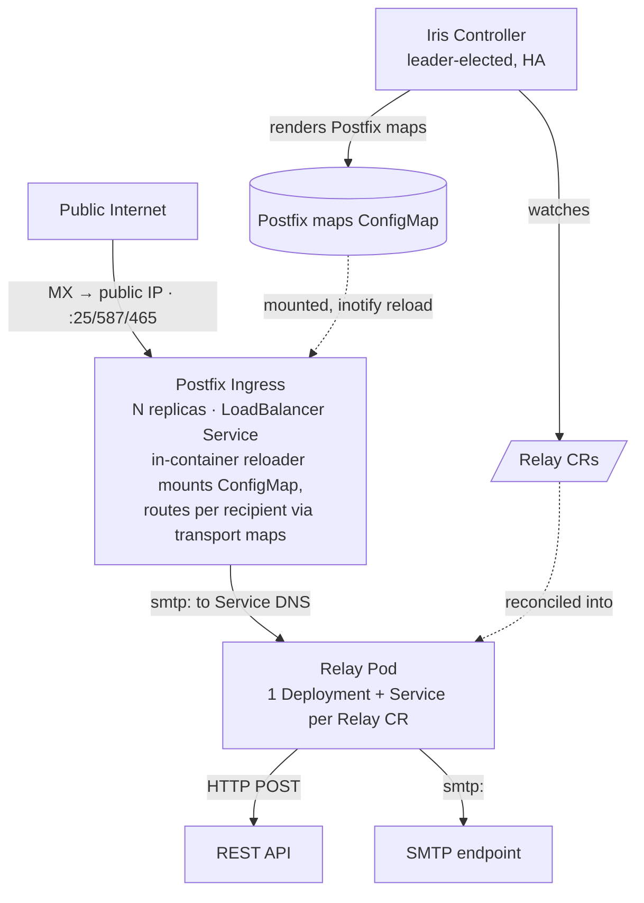

# Architecture

Iris is split into a **control plane** (the Iris controller) and a **data plane** (the Postfix ingress and the relay pods).
The control plane is replicated for availability.
The data plane is replicated for throughput.

## Overview

At a glance, Iris is one shared ingress and controller driving a relay pod per `Relay`:

## Components

1. **Iris controller (control plane)**.
   Go + controller-runtime.
   Leader-elected, replicated for availability (default 2 replicas, but only the leader reconciles).
   Runs two reconcilers under one manager (see [kubernetes.md](kubernetes.md#controller-internals)).
   Owns CRD status and a validating webhook.

2. **Postfix ingress (data-plane front door)**.
   A `boky/postfix` Deployment (N replicas) behind a LoadBalancer Service on 25/587/465.
   Provides TLS (opportunistic STARTTLS), queueing, retry/backoff, and bounces.
   Configured via the Helm chart (a singleton per install, like ingress-nginx's controller) and **not** a CRD.
   Its routing config is generated from the `Relay` CRs.

3. **Postfix image + in-container reloader**.
   A custom image `FROM boky/postfix` with a small reloader process (`cmd/reloader`) that watches the mounted routing maps (inotify), copies them into a writable work directory, compiles them with `postmap`, and runs `postfix reload` on change.
   The copy is needed because the ConfigMap mount is read-only and `postmap` writes its compiled database next to the source file.
   The image entrypoint seeds the work directory, points Postfix at it, and runs the reloader as a background companion to the Postfix master.
   A separate sidecar is **not** used because it cannot cleanly signal another container's Postfix master (separate process namespaces, shared queue/spool issues).

4. **Relay pod (data-plane transformer)**.
   A single reusable Go image (`emersion/go-smtp` server).
   One Deployment+Service per `Relay`.
   Receives SMTP from Postfix, applies filters, transforms, and delivers.
   Configured entirely from a mounted file + mounted Secrets, and **needs no Kubernetes API access**.
   The generated pod runs under a `restricted` Pod Security compliant `securityContext` so relays are admitted in namespaces that enforce it, keeping only `NET_BIND_SERVICE` so the relay can still bind its privileged SMTP port.
   Internals in [relay.md](relay.md).

5. **Helm chart**.
   Installs controller + CRDs + RBAC + Postfix tier + LoadBalancer Service + webhook + ServiceMonitor + PDB, mirroring the ingress-nginx chart layout.

## Data flow

1. Mail arrives on the public LoadBalancer (port 25/587/465) and is accepted by Postfix.
2. Postfix's `transport`/`relay_recipient_maps` (generated by the controller from `Relay` CRs) route each recipient to the matching relay's **Service DNS name** via the `smtp:` transport.
3. The relay runs the inbound pipeline (filter → transform → fan-out deliver) and reflects the result back to Postfix as an SMTP status code.
4. On failure of a `required` destination, the relay returns SMTP 4xx.
   Postfix keeps the message in **its** queue and retries with backoff.
   The relay holds no state.

This is **at-least-once** delivery.
The full delivery contract (idempotency, fan-out atomicity, `required` gating) is documented in [relay.md](relay.md#delivery-contract).

## Public exposure

Published through a Kubernetes Service in front of Postfix, configured by
`exposure.service.type` (the standard Service type enum). Port 25 is raw TCP,
which avoids HTTP-first ingress controllers entirely:

- **`LoadBalancer`** (default, v1).
  A Service `type=LoadBalancer` on 25/587/465.
  The cloud LB gives a stable public IP for MX records.
- **`NodePort`**.
  Fixed node ports (pinned via `exposure.service.nodePorts`) for clusters
  without cloud LoadBalancer integration, where an external load balancer
  forwards the SMTP ports to the nodes (e.g. bare-metal or dedicated servers).
- **`ClusterIP`**.
  Cluster-internal only, for when external L4 infrastructure targets the
  in-cluster Service.

Setting `exposure.service.enabled=false` renders no Service so operators can
wire their own. A `traefik` `IngressRouteTCP` exposure (a documented, later
phase) would slot in as a sibling under `exposure`. It requires a dedicated
Traefik **entrypoint** on port 25 in Traefik's _static_ config (cannot be
injected by a CRD), which is the known friction point.

TLS: opportunistic STARTTLS on inbound, with certificates via cert-manager.

## Key properties

- **Relay-pod churn never reloads Postfix.**
  Transport targets are Service DNS names, so kube-proxy handles pod IP changes.
  Postfix reloads only when a route (`Relay`) changes.
- **Raw TCP ports are declared once** on the LoadBalancer Service.
  Everything below is dynamic.
- **All stateful, hard-MTA concerns live in Postfix.**
  Everything Iris itself owns is stateless.

## Observability

Every binary exposes health/readiness probes, Prometheus metrics, and Sentry error reporting.
The controller uses the controller-runtime manager's metrics + probe servers.
The data-plane binaries (relay, reloader) use [`kula-app/go-health`](https://github.com/kula-app/go-health) + `promhttp`.
Full surface (ports, metric catalogue, Sentry wiring) in [observability.md](observability.md).
